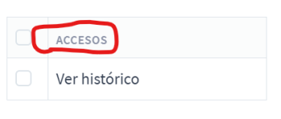

# Cómo definir una política
1. Crear un enumerado en ``Authorization.Policies.Enums``.
	* El enumerado debe tener un nombre único.
    1. Definir un atributo ``[Description]`` para dicho enumerado:
       ```csharp
        [Description("Accesos")]
        public enum AccessPolicies {
        }
	    ```
        * La descripción sirve para dar un nombre que pueda identificar de forma sencilla la política de cara a un usuario.

            
            
        * De no definirse una descripción se mostrará el nombre del enumerado.
2. Cada miembro de dicho enumerado representa **_la política_** a aplicar.
   1. Para que las políticas aparezcan en la pantalla se selección de roles, es necesario
      especificar el atributo ``[PolicyMenuItem]`` al enumerado.
      Las secciones existentes se recogen en ``Authorization.Policies.Menu.PolicyMenuItem``.
      Se agruparán de forma automática con su propio enumerado.
   2. Cada miembro **debe** disponer de al menos un atributo ``PolicyRequiredClaims``, que indica
       el claim o los claims que son necesarios para dar la política por satisfecha.
        ```csharp
        [Description("Ver histórico")]
        [PolicyRequiredClaims("app-claim-" + nameof(AccessPolicies), nameof(AccessHistoricListView))]
        AccessHistoricListView
        ```
      * Al igual que el enumerado, cada mimebro puede disponer de un atributo ``[Description]``
        que servirá para que un usuario pueda identificar la política que se aplica de forma sencilla.
      * El nombre del claim, que se toma como el nombre del miembro, **debe ser único**.
        Así pues, de acuerdo a lo definido en el anterior ejemplo, no debe haber otro
        ``AccessHistoricListView`` definido en **ninguno de los demás enumerados** ni en el que se encuentra.
      * Se recomienda utilizar nombres únicos para las propiedades ``ClaimType`` y ``ClaimValue`` de 
        ``PolicyRequiredClaims``, y predefinir ``ClaimType`` con un string que represente que es exclusiva
        de la aplicación. Si dos políticas deberían utilizar la misma convinación de ``ClaimType`` y ``ClaimValue``,
        pueden repetir sus defniciones del atributo sin problema.

3. La aplicación aplicará la política de forma automática según su definición.
   Para ello, utiliza el método ``GetAllPolicyClaims`` dentro de ``Authorization.Policies.AppIdentityPolicies.cs``.
    * Este método devuelve un ``Dictionary`` donde su ``Key`` es la Descripción o nombre de cada enumerado definido.
      Sus ``Value`` son cada una de las políticas definidas dentro del enumerado, que a su vez disponen de
      una enumeración de Claims que se le aplican. El ``Dictionary`` estará ordenado por sus ``Key``.

# Cómo controlar el acceso por políticas
## Controladores del Backend
Para restringir el uso de un controlador del Backend a un usuario, solo es necesario aplicar el atributo
`[Authorize]`, rellenando el valor de `Policy`. Se recomienda utilizar el operador `nameof()` junto con una ruta
del miembro que represente la política a aplicar (ver punto **2** de la sección anterior). De esta forma se
mantiene una consistencia entre los posibles cambios que pueda haber a nivel de código y referencias.
```csharp
// El siguiente cóigo aplica la necesidad de cumplir con la política "PolicyMenuConsole" que,
// gracias a la definiciónde atributos, reconocerá los Claims que el usuario debe tener.
// El controlador solo responderá si el usuario cumple con la política establecida.
[Authorize(Policy = nameof(Identity.Authorization.Policies.Menu.PolicyMenu.PolicyMenuConsole))]
public class AccessesController : Controller
{
}
```

## Código HTML de Razor (cshtml)
El proyecto de la aplicación web dispone de un `TagHelper` llamado `PolicyCompliant` situado en 
`Efor.SupervisionConsole.Helpers.RazorTags` que se encargará de decidir si renderiza o no el
código al cual se aplica. Para facilitar su uso, ya se ha configurado el archivo `_ViewImports.cshtml`
para que incluya la definición del TagHelper, de modo que se encuentre dsponible en toda la app web:
```cshtml
@using ZallaZitizenApp.Identity.Authorization.Policies.Enums;
@addTagHelper Efor.SupervisionConsole.Helpers.RazorTags.PolicyCompliant, Efor.SupervisionConsole
```

El tag se define mediante la palabra clave `policy`. Una vez más, se recomienda el uso de `nameof()`
junto con una referencia al miembro del enumerado que represente la política a cumplir. Esto hará
que el contenido del elemento HTML solo se renderice si el usuario cumple con las exigencias de la
política definida.
```html
<li policy="@nameof(MenuPolicies.MenuConsole)" class="nav-item" id="consoleIcon">
    <a id="consoleNavIcon" class="nav-link" asp-controller="console" asp-action="index">
        <span class="nav-icon">
            <i class="fe fe-home"></i>
        </span>
        <span class="nav-text">
            Consola
        </span>
    </a>
</li>
```

## Comprobación en Runtime
Existe la posibilidad de hacer uso del código proporcionado por AspNetCore para comprobar, en tiempo
de ejecución, si un usuario cumple con la política especificada:
```csharp
public class MyController: Controller {
    private readonly IAuthorizationService _authService;

    public MyController(IAuthorizationService authService) {
        this._authService = authService;
    }

    [HttpGet]
    public IActionResult MyAction() {
        var success = await _authService.AuthorizeAsync(User, nameof(Identity.Authorization.Policies.Menu.PolicyMenu.PolicyMenuConsole));
        if (success) { return Ok(); }
        else { return Forbidden(); }
    }
}
```